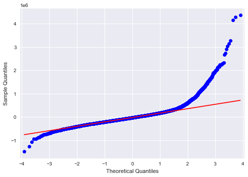
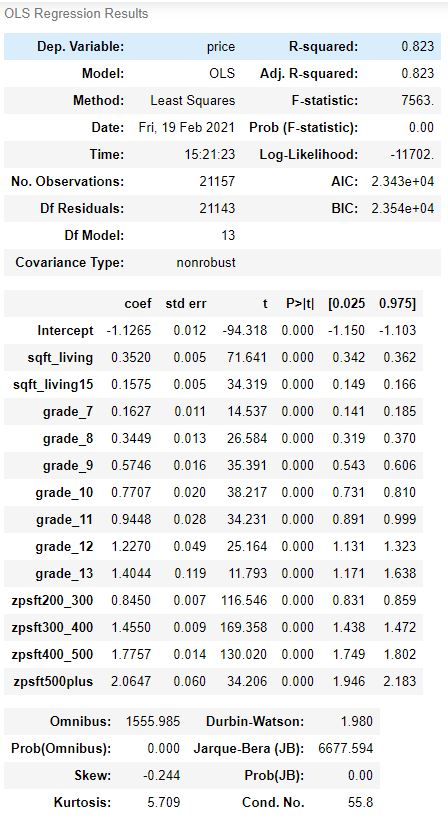
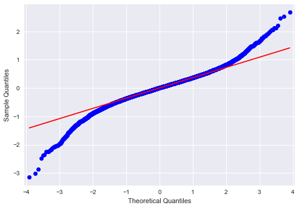

# King County, WA Real Estate Data Analysis for Residential Real Estate Agencies  
### Authors:  
[Jamie Dowat](mailto:jamie.dowat44@gmail.com)  
[Svitlana Glibova](mailto:s.glibova@gmail.com)  

## Contents and Data  
`img` contains images and visualizations used in the presentation and notebooks.  
`notebooks` contains independent EDA notebooks used to create the `final_notebook.ipynb` file. Within this file, the `bakeoff` folder contains 
experimental predictive modeling as a side-project to the inferential modeling done in the main project.  
`src` contains source code and data files that were used in the final notebook.  
Data files were obtained from [King County Department of Assessments](info.kingcounty.gov/assessor/DataDownload/default.aspx).

`presentation.pdf` is a .pdf file containing a non-technical presentation of our data.  
  
## Business Understanding
As the world becomes more tehcnologically savvy, highly-competitive markets like real estate are reaching for more rigorous analytics to 
help them stay ahead. Although there are a number of stakeholders in the industry, the focus of our analysis is to maximize profit for
residential real estate agencies and realtors, whose income directly depends on price of the house they sell and their client relationships.  
Our main question to address is how to best assist clients in offering on and setting home prices.  
## Data Understanding and Methods  
The data set contains over 20,000 records of individual homes and their features, which we used for the data exploration and feature engineering stages.  
We created correlation matrices for the home features to determine which features had the greatest correlation with prices and refrained from
using features that were too highly correlated with each other in order to avoid multicollinearity and create stronger models.  
The first feature that was most strongly correlated with price was `sqft_living`, which we used to engineer a price per square foot feature in order to create
groups of homes within similar price ranges. Several other strongly-correlated features included:  
* `condition` - rated 1-5 by King County, with 3 being the lowest inhabitable condition (not requiring severe remodeling)  
* `grade` - rated 1-13 as an overview of the quality of the home's construction and its luxury features (per [King County Glossary](info.kingcounty.gov/assessor/esales/Glossary.aspx?type=r))  
* `zipcode` - which we used in combination with per-sqft pricing to map areas by their home prices
* `sqft_living15` - a mean of the square footage of the home's 15 nearest neighbors, useful for comparing properties
* `sqft_lot` - the size of the entire property  
* `waterfront` - more useful for the 'Luxury' (home grade 10+) subset, but strongly correlated with price  

Several of our engineered features include:  
* `in_city` - indicated whether the home is in a Seattle zipcode  
* `unincorporated` - indicated whether the zipcode was in a municipal area with services or not
* `location_cost` - a grouping indicator of which price-point the location of the home is in

Due to the focus of this analysis being residential realty, we subset our data in the following ways:  
* Condition 3 and above - to only include inhabitable homes
* Grade 6 and above - for the same reason as condition   
* All homes within 3 standard deviations of the mean Per Square Foot price to reduce outlying data.  

## Modeling  
### Initial Model  
Because `sqft_living` had the highest initial correlation, we used that to create our first simple model with the following formula:  
`formula = 'price ~ sqft_living'`  
  
This first model had an R-squared of .493, so it was not able to explain a lot of the variance very well, and as you can see by the qqplot for 
graphing the residuals (errors), the rate error was very high for high and low values of x. From analyzing this model, we could see that our
data did not meet the assumptions of Linear Regression very well.  
Following this first model, we used several transformations to normalize and center our data to a more Gaussian distribution and created
several more models using Ordinary Least Squares, which produced much higher R-squared values and significant p-values.  
### Updated Model for All Homes  
  
This model explained variance to a fairly high degree, with virtually no issues of multicollinearity, although there was still some variance.  

## Summary
Overall, it was noticeable that normalizing and transforming the data, as well as subsetting it to reflect different populations and needs was
successful in increasing modeling accuracy. From a business perspective, we were able to highlight several important features that contribute
to home prices, namely:
* Location  
* Overall square footage of the home   
* Value and size of neighboring homes  
* The home's condition  
* Its luxury features (or lack thereof)  

Below, you will find a map of King County zipcodes to provide a reference for location and proximity to the city of Seattle.  

##### To access all of our sources, or for more details about our process, see `final_notebook.ipynb` or `presentation.pdf`.

### King County Zipcode Map

